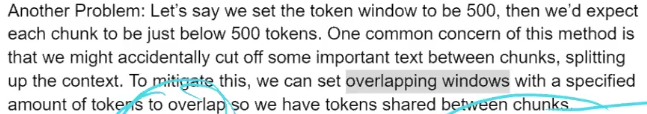

# NLP-LLMs-and-GenAI
Let’s explore the differences between Natural Language Processing (NLP), Large Language Models (LLMs), and Generative AI.

1. NLP (Natural Language Processing):
    * **Purpose**: NLP focuses on understanding and processing human language. It enables machines to interpret and generate text.
    * **History**: NLP has a long history, starting from early experiments in the 1950s when computers first attempted language translation. Over time, it evolved from simple word substitution to understanding syntax and grammar.
    * **Capabilities**: NLP allows machines to perform tasks like sentiment analysis, named entity recognition, machine translation, and chatbot interactions.
    * **Foundation**: NLP serves as the foundation for both LLMs and Generative AI1.

2. LLMs (Large Language Models):
    * **Building on NLP**: LLMs build upon NLP by using its capabilities to generate coherent and contextually relevant language.
    * **Contextual Understanding:** These models understand context and can generate text that goes beyond mere mimicry.
    * **Examples**: Well-known LLMs include GPT-3 (Generative Pre-trained Transformer 3) and BERT (Bidirectional Encoder Representations from Transformers).
    * **Applications**: LLMs are used for text generation, question answering, and language understanding1.
3. Generative AI:
    * **Definition**: Generative AI is a broader concept that encompasses various forms of content generation.
    * **Beyond Language**: Unlike NLP and LLMs, Generative AI extends beyond language. It includes image generation, music composition, and more.
    * **Innovation**: Generative AI models innovate by creating new content rather than just understanding or mimicking existing content.
    * **Examples**: Creative applications of Generative AI include generating art, writing poetry, and composing music.
    * **Advancements**: Advances in neural networks and computational power have fueled the growth of Generative AI1.
In summary, NLP is about understanding and processing language, LLMs build upon NLP for advanced text generation, and Generative AI takes the baton to create innovative content beyond language boundaries


# Natural-Language-Processing
Notebook : https://colab.research.google.com/drive/1iMMiFBbxxWanSs0sGIAa-o6kyARhyR4D#scrollTo=49ccbc25

```
Natural Language processing help us to understand the text data.
```
```1. Document: one tweet, one sentence, one article, one whatapp message, one ticker is consider as documnet in NLP. Even one word is also called document. One document is basically one row of data.```

```2. Corpus: Union of all documents in your training data.```

```3. Token: Token a basically one word or one special charactor or one number which can be seperated with space. ```

```4. n-gram: some time one token contain n words which is called n-grams.```

```5. bi-grams: when one token contain 2 words it is called bi-grams.```

```6. Tokenization: Tokenization is basically splitting of documents into smaller conponents either it could be words it could be sentence or it could be charactor also, but generanlly we do not go till charactor.```

    `Word-Tokenization`: meaning if we have a string(i.e the car was fast) if i do word tokenization, it will give me the list of tokens inside the sentence. like ['The', 'Car', 'was', 'fast']

    `Sentence Tokenization`: if there are multiple sentences(i.e The car was beautiful. The car was fast.)it will give list of sentences. like ['The car was fast', 'The car was beautiful']. here the sentence sperator is [.!?]

`7. Vocabalory: Union of all the words in the corpus` <br>
The resion why we learn about this small definatin because in NLP world there is nothing called feature map or row, columns etc. we use `tokens`, `documents`, `corpus` etc

## Agenda for NLP
1. Understand the preprocessing function in NLP
2. way to convert text data into vector.
3. What are our model that helps us to understand the text data <br>
    model :- RNN, LSTM, Transformer <br>
    Throught this model we are model are solve certain problems like:
    1. Language Model
    2. Translation
    3. Summerization
    4. Named entity recognition(NER)
4. Additionally, Gernerative AI --> Specifically Large language model

-----------------------------------------------------------------
### What is NLP? Define NLP?
```
NLP is a field of study that gives the human ablity to interact with a system in natural language.
```


### What are the Challanges unique to NLP? why NLP is difficut? and why NLP has so much money?
Q. What is the __Challenges of NLP__? and why? <br>
A. There is no Universal mathematical representation of words.
```
1. Multiple Languages
2. Romonised Languages: i.e main ghar nahi jaunga.
3. Context is very Subjective. i.e apple is company or fruit.
4. Sercasm
5. Emotion
6. Humer
7. Spelling Mistake
8. Emoji
```

Q. What are the problem of NLP?
1. What is the Machanism to convert **words** into **vectors**. <br>
`A. it can be solved using embedding.`
2. How do i convert this **Vectors** into meaningful **Model** to solve some kind of problem.

### Embedding: 
Solve the problem how do I convert words to vector in meaningfull manner.
1. Frequency based `Document Term Metrix`
2. Prediction based

### Document Term Metrix:


#### disadvantage: 
Q1. squence of word can not be cature at all in Document Term Metrix. How can you solve it? <br>


`A: n-gram, Instead of having uni-gram in the column can i have bi-grams/tri-grams/quard-grams in the column that will acturally capture phrase instade of words to an extend sequence of problem can be solved`

Q2. Sparse Metrix
`A: Let's say if i catpute 50 thousand tweet in my corpus, what will be Vocabalory size on an average.`
`If i have 50k tweet in my corpus what could be vocabalary size.
if there is 50k tweet then i may have more then 100k indiviual token.` <br>
`limit of single tweet is 260 charactors which mean 20 to 25 words, if we put on Term Metrix, the staring 20 columns got 1,1,1,1,1,1... rest 999k will be 0,0,0,0,0...` <br>
`like same way if 2nd tweet has 15 words it present once in all 15 words and rest(100k - 15) will be zeros.` <br> <br>
Q. How can we solve the problem of sparse metrix? <br>
`A. Our Aim is to reduce he columns, how can we do this in term of documnet term metrix` <br>

    How do we create some preprocessing function on text?
1. **Remove stopwords**: Stop words is very generic word which donot have a specfic meaning. for example, is, an, the, becasuse, couldn't etc. They are not helping us in defining words.
2. Some of the unused things in documents:
    * This step can be done using `regex`. anything appart from A-Z and a-z should be remove.
    1. Stopwords
    2. numbers
    3. charactors
    4. Hyperlink
    5. Speical charactor
    6. removing panchuation 
    7. human spelling mistake: like aa, abb, abc etc. it don't make any sence how could you remove this. <br>
3. **Stemming & lamatization**: it help us to get the root word of a verb. example run vs running, catch vs catching etc. <br>
`convert every words into there root word.` <br>
    1. Lamatization: Lamatization has english structure in term of verb, adverbe, adjective etc store in tree based data structure, lamatization has that infomation.
    * Lamatization is very logical, it understand the entire english language.
    * In lematization, if the word is verb then only you can change the word, if it is noun you can not change the word. for example, shopping, increased etc
    2. stemming does not has that information, stemming is stupid, It does not have the understanding of infomation. <br>
    * it has so stupid it has given some rule like 5th class student, like if you see `caring` remove `ing`, if you see `cares` remove `es`, if you see `esses` remove `es` etc. 
    * Algorithm which are used in stemming is `porter stemming`, it is just a set of rules and don't have much knowledge of english language.
    * it is mainly used in creating `Documnet Term Metrix`. 
    * In stemming some of the pattern are correct and some of the pattern are wrong. 


### What are my use-cases in NLP? what kind of problem we can solve using NLP?
1. `Document classifiction`: can i take a sentence or news article, or a tweet and classifie it into certain classes. or simple classifiction problem. <br>
use-case 1: **ticket routing system**; suppose you help some techinical problem you enter the description of the problem based on the description you ticket get routed to HR, IT system, manager etc. <br>

2. `Sentiment analysis`: can i take some article or tweet and find out the sentiment analysis.

3. `Language Model` (like chatbot): like chatgpt, where we can solve multiple problem for example: <br>
**1. Summerization Probem:** given a long sentance can you do summerization. <br>
**2. Translation Probem:** Given a sentance can you convert it to some other language <br>
**3. Question Answering:** Given a question can you answer. <br>
**4. Auto Complete:** <br>
**5. Name Entity Recongnition:** for example 1, from the written text can i extract the **symptions**, **dignosis**, the **treatment steps** and the follow up **date** this is called named entity recognition.
    ```                     
                        Patient Report
    The patient was diagonised with Tythroid. the following steps were mentioned for the treatment. 
        Dolo 650 3x3
        paracetamole 1x1
        pentasharfa 2 time
        etc...
    the patient has advice to meet after 5 days.
    ```
    ```Project idea: Create an API for this and upload to AWS```

    ```
    example 2: from the transcript of the meeting can i extract the **plan of action**, the **POCs** and next meeting follow up **date**. 
    ``` 
4. `Image to Caption`: Image to **text**, Given an image and generate a **caption** to that image. <br>
5. `Text to Image`: Given an **text**, can I generate the **image**. <br>
6. `Image to Text`: OCR(combination of CV & NLP), given a **text image** can i get the **text**. <br>

*These are the things we are consider in natural language processing. early `1` chatbot solves `1` probem now take an example of `chatgpt` it do almost everything.*


### How do I crate a machine learning model in text data
-----------------------------------------------------------------


Innomatics Research Lab
### Given a word, predict the next word

### loss
```python
model.compile(loss='sparse_categorical_crossentory', optimizer='adam', metrices=['accuracy'])
model.fit(x,y, epochs=10, batch_size=32)
```
1. Categorical crossentropy
    - Y, should be encoded format to perform categorica crossentroy
1. Sparse Categorical crossentropy
    - accept your y in the form of interger
    - use in term of LSTM


```````````````````````````````````````
Master Class on NLP(day 3)
```````````````````````````````````````
## Spell Correction Model


<br> <br><br> <br><br> <br><br> <br><br> <br><br> <br><br> <br><br> <br><br> <br><br> <br><br> <br><br> <br><br> <br><br> <br>

# LLM - Large Language Model
## Introduction to search engines
Search Engines : 
1. __Google__
2. __Bing__
3. __DuckDuckGo__
4. __YouTube__: Relevant Videos
5. __LinkedIn__: Relevant profile, Job, Post/Article
6. __NetFlix__: provide you relevant Movies, Series, Documentent
7. __Bloombarg__: Relevant News

_Input_ : User's Search Query <br>
_Outcome_ : list of webpages


Match(_finding the similar documnets_) the user's search query with all the doc's in the database

`Q. How to find the similarity?` <br>
Ans - here, we are assuming distance to find the similarity between 2 points.


`Q. Do you know about similarity, what is the way to compute the similarity in computer science and mathematics?` <br>
Ans - Distance, we can find the similarity using distance. 

`Q. How to find the distance between 2 points?` <br>
1. Eucledean Distance
1. Angular Distance
1. Manhatten Distance
1. cosine Distance
1. elavantain Distance

`Q. Which data point are most similary data point in given figure?`<br>

Ans - it depends upon what distance metrics you are taking.
1. As per Eucledean, the closest data point are A and B, and hence AB are most similar.

1. As per Angular Distance and cosine Distance, the angle between AB > CB > AC. hence the most similar in this case will be AC.


`Q. Why we have these many distance metrics? In high dimentional data are we going to use euclean distance or angular distance metrics?` <br>
Ans - In `higher Dim` --> Eucledean distance will fail because of `Curse of dimenality`.
for example, In NLP problem we can not use Eucledean distance, it is recommand to use cosine distance. becuase of BOW/TF-IDF has more then 30k features.

### Use case; we have given a search query(left) and database(right).

`Q. What are we going to apply if a database is given to you?` <br>
Ans - 1. Clean the given data(lamatization or other), <br>
2. after clean data apply vectorilzation <br>

`Q. What is the database for google?` <br>
 Ans - All the available, webpage present on internet is the database for google, such as youtube, blog, articles, etc <br>

 `Q. What is the job the google has to apply in this database?` <br>
 Ans - Google has to go each and every webpage and apply some cleaning and vectorization on webpage. <br>

 `Q. After cleaning and vectorization store the vectorize data?`
 Ans - we need special vector stores databases to store high dimensional numerical representation of data.
 1. __SQL__: MySQL, Orcale, PostgresSQL, SQlite
 2. __NoSQL__: MongoDB, Redish, Casandra
 3. __Vector Store DB__: Vector Store are very powerfull to store vectorlize form of data. for example: ChromaDB(open-source free), Pine cone DB(paid)

---------------------------------
## Search Engine - Building the Frontend and Backend Component
Two main Component for this project
1. __Component 1__: Frontend, where people enter the query


2. __Component 2__: 

    1. __Keyword based serach__: in keyword based search, if we type top 10 laptop then it will only show `top 10 laptop` not the `top 10 computer`, but top 10 computer must also be the query result. because computer and laptop mean the same.
        - similar query: best laptop, best computer, highly performance laptop etc
    2. __sementic search__: the above query has the same search query, without any sementic search

#### About the data

it contain 80k to 100k subtitle files for movies and tv series, size around the 2GB

#### format of dataset

1. Stored the entire data in database file, they don't provide us in the format of .srt or zip file.
1. encode the file in latin-1 and store it into database, database contain 3 columns, unique _id_ of file, _filename_, and latin-1 encode _content_.

#### Task 1: Our first job with given database
1. our job is how to read a table from .db & decode all the files stored inside the table.
1. Do the back engineering and bring the data into .srt format. 
1. basically decode the data 

#### Task 2: Do some preprocess and clean the data
`Dialog number, timestamp, dialog`

1. remove all dialog number
1. remove all timestamp
1. Note: preserve the dialog timestamp
1. lower case
1. stopword remover
1. Stemming/Lamatization
1. create the dataframe contain, `unique id`,  `filename`, and `clean text`

#### to build a keyword based search engine we can use following verization method.
1. BOW
1. TF-IDF
and expriment amoung both the technique and find out which technique is giving best result.
note: tokenization is totally based on the what kind of vectorization we are using


#### Task 3: do the preporcess in query

1. clean the data
1. apply transformation

#### Task 4: apply cosine similarity with query and each row in the preprocess data.

It return the result of cosine, short them in decreasing order. this is example of keybased search engine because we are using here BOW, IF-IDF.

`If we use the W2V/BERT vectrization then it become sementic search engine`
`Q. what is the problem of BOW/TF-IDF?` <br>
Ans - BOW/IF-IDF has very high dimentionality, in simple term BOW/IF-IDF capture each and every keyword, but this huge dimenality come a problem also at the same time we are not preserving the meaning of the word or sementic similarity. where will i go if i wanted to preserv the meaning? it will replace it with word2vec

`Q. problem with word2vec?`<br>
word2vec create lower dimentation vecotor representation, what will happen to a very large document, do you think the context or main sence of document get lost. if our document contain 10k and it gives 300 vector represenation, do you think it lost some information the entire subtile meaning get lost if we try to capture all the information in 300 dimention. it will loss whole sence if i will caputure each and everything in 300 dimention.
- even bart and transformer have the same issue but how to solve it. 

conculsion:
for the sementic search engine, we have to use word2vec bart kind of technique. but to bart and word2vec what is the outcome, the outcome will be lower dimention may be 300 or 500 dimensional. because in Bert or word2vec the compression is going to happen. we are compressing way to much.
- `what too much compression what we will loss?`  information get loss. in a bigger documentation, a bigger subtitle file definitely the meaning or the contect or the main part of the document can get lost with that compression.
- even LSTM and RNN have the same problem of exploding gradinent or vanishing gradient
-------------------------------
### Summary
Component 2:
1. Data Clearning
2. Vectorization

Component 1:
1. Query Clean
1. Vector of query
1. similarity calculation between query vs all the docs. it is like KNN
1. Reorder the search results based on similaity score

`Q. what will be the dimenstion if we apply BOW/IF-IDF on 82k .srt data?` <br>
Ans - 
dim = 82k * d, where d is number of unique vocab words

disadvantage of BOW/TF-IDF
1. high dim
1. highly sparased
1. no semantic info preserv

advantage of w2v
1. low dim
1. Dense Representation not sparased
1. sementic info preserver, it understand computer and laptop is same.

#### Embedding
Embedding is nothing but a lower dimenation dense representation of text data. dense representation is typicallly called embedding.

#### Numerical vector
numerical vector is it can be sparse or desnse represenation. but dense represenation is typally called enbedding.

#### BOW/TF-IDF vs w2v
BOW/TF-IDF takes each word as a unique dimention. but w2v do the same, it will take each document and try to give smaller represenation a dense representation the dimenstion of these representation is very low, dimenstion low mean may be you capture less information.
`Note: BOW/TF-IDF is definitly preseve information but it comes at a cost and the cost is high dimenation and sparase represenation but in w2v it has less dimenation and you end up with lossing information.`

`Q. How do we solve this problem?` <br>
Ans - BERT: Use transformer to solve this issue

`Q. If we use W2V then it will convert the higher dim data into lower dimentational represenation, which result in loss of information gain. How to preserve this?` <br>
Ans - Use Chunking of data, form one data point make multiple files using chunking, it will explode the number of rows and we end end getting very large database, 82k row converted into 820k rows, then apply W2V/BERT.

steps:
1. do transformation on query
2. find out cosine similarity to each 820k rows of data.

### Document Chunker
Divide a large documnet into smaller, more managable chunks for embedding.

### Overlapping windows



### Task: Find the movie name based on famour dialog provided in search query.


# Various Vecotrization technique
https://github.com/bansalkanav/Machine_Learning_and_Deep_Learning/tree/master/Module%204%20-%20Machine%20Learning/02.%20Working%20with%20Text%20Data/1.%20Intro%20to%20Text%20Preprocessing
1. __BOW__: it is a count based approch. how may time a certain word repeated. it has lot of short comming.
    * it gives high dimenality.
    * sparcity is very high in BOW representation of text data. sparcity a lot of zeroes is present.
1. __TF-IDF__: word importance, if more frequent word less important, less frequent word is more important. need of word important in case of sentiment analysis. 
common problem
 * sementic - understand the meaning behind each word
 * Dim high
 * high sparse
 * sequence is not order
 
3. __Word2Vec__:(google) preserver the word order or sequence is not order
 * dim is very low for word2vec compair to BOW/TF-IDF
 * sparcity is not there
 * highly dense
 * it leans the sementic behind all the word.
 

ANN used here to find out the vector
problem of word2vec: it does take into account the order of word, it is dense
4. __FastText__: Facebook preserve squential information
5. __RNN/LSTM/GRU__: generate low dim, highly dense, perserve sementic learning happen, preserver sequence infomration.
 
biggest drawback: train is very slow, computaionlly very expensive, fail to preserve long sentence
6. __Bert__:


----------------------------------------------

# Distributed and Contextual Representation (BERT)
1. Introduction to GenAI
1. Transformers
1. LLMs
1. Prompt Eng
1. Openai & HuggingFace
1. __Langchain__: help to build gen AI backend application, __Flask__: to build web apps


https://github.com/bansalkanav/Machine_Learning_and_Deep_Learning/tree/master/Module%209%20-%20GenAI%20(LLMs%20and%20Prompt%20Engineering)/1.%20Text%20Embeddings

`Semantic Represenation: W2V, Glove, FastText` <br>
give a text data to an algorith at word2vec model generated. How can you generate?
1. CBOW
2. SkipGram
3. SkipGram with negataive sampling 
which allow us to generate w2v model. what this word2vec learn? it will learn simply semantic represenation of text data.

### Difference Between semantic represenation and contextual representation
The Technique that used in contextual represenation is called BERT. BERT not only learn contextual represenation but also learn the sementic represenation. <br>
where as  w2v, glove, fastText only learn semantic represenation not contextual represenation.

based on context anaconda, python is tools or animal, same goes to amazon it is forest or company.

based on the context of the word same word get __differnt numerical represenation__. <br>
W2V, glove, fastText all of them give signal represenation of data but BART give differnt numeric represenation beased on context of the data.
__Hyperparameter of Bert__: how far we should go to find the context of the word.

__Anaconda__, __Amazon__, __Anaconda__, __Python__

`Note: One word can have multiple meanings. This meaning can be represenated by looking at the near by words of context` this is called contextural represenatation. BERT & ELMO can do contextural represenation. Before BERT ELMO are used to do the contextural represenation.


`Q. Why does word order os not preserved in ANN?` <br>
Ans - ANN are not preserver the sequential information, there is problem with the architecute there is no problem with the technique.

`Q. How to resolve the problem, can i replace this architcure with something else?`
Ans - Yes, we can simply use some that takes word order in considration, which is RNN, LSTM, GRU. if we take such model that it preserve the word order or sequential information.

`Note: The output of ANN is W2V, Glove and FastText` <br>
`Note: The output of LSTM is ELMO, with LSTM we can generate the model like ELMO. also there are 2 major problem`

`Q. What is the problem if we change ANN to RNN?` <br>
Ans - Problem 1: <br>
there is `problem of long term dependency`, which algo solve the problem the long term dependency. LSTM is use to handle the long term dependency, but it can not handle all the long term dependency. it can not handle very long sequence. <br>
__LSRM__, __GRU__ fails if the squences become extremly long. __exploading gradient__ and __vanishing gradient problem__ will be there.

Problem 2: <Br>
The Second problem with LSTM, GRU approch is they process every single token at time, one token at a time. if we have 2 billion token, is it really a good idea to process 1 token at a time? `NO`.
it is very slow process `RNN`, `LSTM`, and `GRU` process 1 token at a time that is why it is very very slow process.

in simple term since we are learning sequencal dependency that what happend the sequence is process one token at time.

`Q. What is the next arthitecure to solve this 2 major problem?`
1. problem of long term dependency
1. problem of slow process of each token <br>
Ans - Next neural network articheture that help to prevent this issue is `Transformer articeture`.

`Q. What is the model given by the transformer architecure?` <br>
Ans - A transformer architecture that is a neural network architecure it gives the model which is called `BERT`.

### Benfit of Transformer Architecure
1. it don't have long term dependency
2. it is hightly scaler, highly parallel or highly flexible which is no problem of slow tranning. it is very fast tranning.

`Q. How tranning time is reduce in Transformer?`
Ans - because of parallel architecure of transformer the tranning time has reduce considiabily because of that only we have really good machine learning model which is called BERT and GPTs out there.<br>
because of parallel artichure what happend the time taken to train is reduce very significtly.

`Q. Can LSTM train prallely?` <br>
Ans - No, they are sequential artichtures. Transformer can train parallely.

`Q. Can ELMO architecure is train using LSTM?` <br>
Ans - YES, ELMO architecure is trained using LSTM Architecture.

### Different methods to understand the meaning of word
1. __Contextural Representation__: One word can have multiple meanings. This meaning can be represented by looking at the nearby words or context.
2. __Attention__: In order to understand the meaning we don't need to look at all the surrounding words. just by focusing on few important words we can understand more about each word.

### All Vectorization Technique

W2V, Glove, FastText: out of this FastText take care of `out of vecuballary word. but it don't preserver the sequential information.

`Q. How to W2V trained? Give me technique`
Ans - 
1. CBOW
1. SkipGram
1. SkipGram with negative smapling

`Q. what is the algorithm used in W2V, Glove and FastText?` <br>
Ans - Algorithm is used is ANN, they use sallow artifical neural network to train this algorithm.

`Q. what we will change in above algorithm to preserve the sequence infomation?` <br>
Ans - Just change the architecture from ANN to (RNN, LSTM, GRU) to preserve the sequence information also.

`Q. is there any architecure build to solve the Out Of Vacabually(OOV) and Contextual embeddings?` <br>
Ans - ELMO, ELMO use LSTM internally and because of LSTM what happen it is `not parallel process` and it does not take care of `long term dependency`.

`Q. Which algo wins?`
Ans - Transformer Architecture(BERT)

# GenAI

`Q. what is Contextural represenation?`<br>

Ans - Contextural Represenation means one word can have multiple meaning based upon the context in which the word is used.

`Q. What is Distributed Representation?` <br>
Ans - Distributed Representation is nothing but dense represenation and low dimentational represenation of text data. earler approch they use very high dimentation and sparse, discributed representation is comes up with low dimentation and dense represenation of text data.

`Q. What is the example of Distributed represenatiation?` <br>
Ans - Word2Vec, Glove, FastText


`Q. what are Arichitecture and technique used by w2v?` <br>
Ans - __Arichitecture__: Shallow ANN <br>
__Technique used__: CBOW, SkipGram, SkipGram with negative sampling.

`Q. What are Architecture and technique used by ELMO?` <br>
Ans - __Architecture__: Bi-directional LSTM, it is not basic LSTM, LSTM which look into forward as well as backward direction, word sequence is learn in both the ways.<br>
__Techinque__: Language Modeling

`Q. Why we use Bi-directional LSTM?` <br>
Ans - it is not good idea to find the context using only one direction, both forward and backword word sequence is require to find the contect of a word.

`Q. Why ELMO(Embedding from Language Modeling) is bi-directional contextual represenation?`
Ans - Because it used Bi-direction LSTM

`Q. What is Long Term Dependencies` <br>

Ans - in order to find the word journey you have to see long back and then find the meaning.

`Q. Why RNN do not work for the longer sequences?` <br>
Ans - It depends upon multiple things
1. RNN/LSTM has vanishing gradient problem and exploding gradient problem. if you go very far from the sequence the gradient you trying to learn it will vanish itself.
1. And there is exploding gradient problem which makes RNN very unstable.

`Q. Which model can handle Long Term Dependency?` <br>
Ans - BERT: Bi-direction Encoder Representation form Transformer.


`Q. How BERT handle the Long Term Dependency?` <br>
Ans - Because of Architecture change, `transformer` is the Architecture for BERT, and technique used in BERT is `Language Model`. <br>
* the main difference is that BERT simply discared the Bi-LSTM with transformer.
* BERT take care of Long Term dependency because Transformer has very nice concept internally inbuild which is called attention machanism and because of this Attention machanism inbuild in Transformer it take care of long term dependency.

`Q. How does BERT handle the slow learning?` <br>
Ans - Slow learning get handle in BERT because Transformer can be parallel train they are scalable and flexible architecture and they work very well with GPU's and TPU's. <br>
`Scalable`: Scalable means they didn't train the BERT in single machine they scale the training in multiple machine to train the BERT.

`Q. What are the approches used in BERT?` <br>
Ans - Masked LM(language Modeling) & NSP(Next sentence prediction)


# Introduction to Prompt Engineering
Promt Engineering
1. Write clear Instruction
2. Few-Shot Learning
3. Output Structure
4. Prompt Personas

Library
1. openai by OpenAI
    * LLM --> GPT: Not opensource pay as you go
    * DALLE --> Takes Text to generate Image
    * SORA --> Text to Video
    * Whipes --> Takes Audio to gernerate transcript(text)
2. huggingface by HuggingFace
    * LLM - other GenAI Model, it is opensource like github page
3. Gemini by Google
4. LLAMA by Meta
5. Copilot by Microsoft
All OpenAI, HuggingFace, Google, Meta, Microsoft they all have LLM.

### Conversational AI Applications
1. ChatGPT(3.5, 4.0) 
1. Gemini
1. Copilot